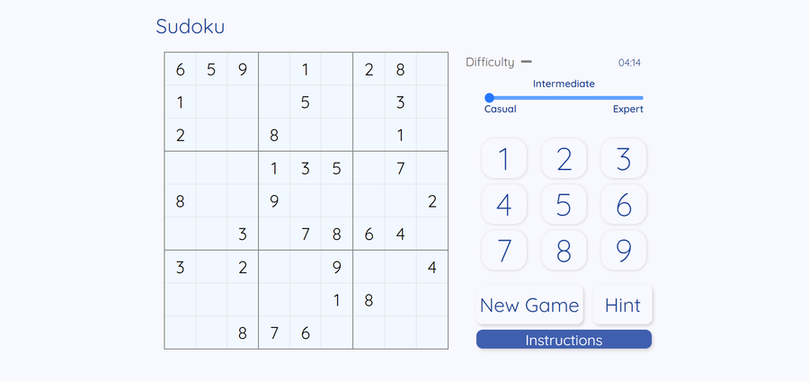
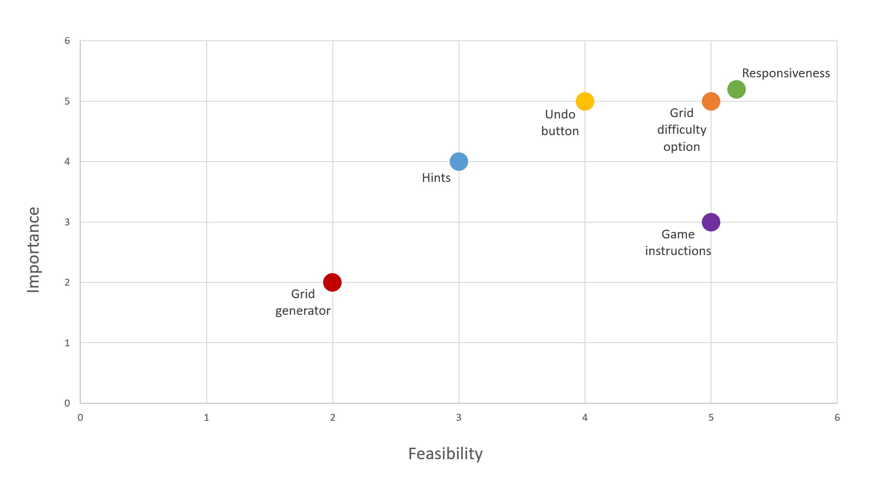

# Sudoku
The aim of this project is to create a grid based number puzzle called Sudoku. It will have a simple, one page design and different features that make the game more enjoyable.
  
This is the second project in Code Institute Full Stack Developer program based on HTML, CSS, JavaScript and optional frameworks.

## UX

### User Stories
- I am a first-time player and am interested in finding out how the game is played.
- I am a casual player and I want to play a fun Sudoku game with a nice design and simplicity of use.
- I am an expert player and want more difficult puzzles to challenge myself and improve logic skills.
- I want different features that will make it easier to play the game like the undo button for when I make a mistake.
- I want the game experience to be as good on mobile as it is on desktop so I can play on the go.

### Planes of UX

#### Strategy
There does not seem to be a lot of research available on what a typical Sudoku player is like and if the preferred way of playing is desktop or mobile. Inspiration on design and features to include will be taken from other online Sudoku games. Simple features will be implemented with possible addition of more complex features depending on feasibility. The main goals are to create a fully responsive website/game that covers most or all of the needs expressed in the user stories. The game should be challenging, easy to use and fun to play.  

> I have generated a chart based on the importance and feasibility of the main goals. This is just an estimate and it might prove that some features are harder to implement than expected. Most goals are high on the chart apart from generating a new sudoku grid each game. That will have the lowest priority.

#### Scope
1. The game should be playable and offers the same experience across different devices. This means that a number keyboard is on screen to enable mobile inputs.
2. The minimum playable version includes a premade grid, a right/wrong signal on input and a new game button.
3. Game instructions are included.
4. Grid difficulty options for premade grids are available.
5. Undo button is available.
6. A hint button is available.
7. A generator should generate a new grid each game.

> This list should be done in order as the tasks were defined in the strategy plane. When it comes to grid generator, it is not something that necessary improves the game since the difficulty is not generated. From the users perspective it is not as important, but as it is the hardest thing to do and it is a good JavaScript challenge, it might still be included in future updates.

#### Structure
The website is a simple, single-page game and no advanced structure is necessary. Main focus will be the Sudoku grid which will be surrounded by other features. The number keyboard should be on the bottom while on mobile since it is easy to reach. The only feature that will lead from the main page will be the instructions. They will be implemented via modal which has an easy navigation.

#### Skeleton
[Mobile wireframe](assets/readme_images/mobile-wireframe.png)  
[Desktop wireframe](assets/readme_images/desktop-wireframe.png)

> The wireframes are not too complex and just show the general layout which will more than likely be improved upon.

#### Surface
Since the game of Sudoku is analytical, a more serious, non-script font type Quicksand is used. There is a light color palette with sufficient contrast that is easy to look at for longer periods of time.

## Features
- Hint button
- Game timer
- Load animations
- Game instructions
- Option to choose difficulty
- Wrong/right signal on input
- Full row/col/square animations
- Responsive grid with 9 templates
- On-screen keyboard for mobile devices

#### Possible future features
> Some of the features that came to mind but could not be implemented due to time constrains are: dark mode, grid generator and possible candidates for each cell.

## Technologies used

##### Languages and frameworks
 HTML5  

 CSS3  

 JavaScript  

 jQuery

##### Repository, coding environment and version control
- [Github](https://www.gitpod.io/) - hosting platform for managing repositories and more
- [Gitpod](https://www.gitpod.io/) - coding environment
- [Git](https://git-scm.com/) - used for version control

#####  Resources
- [Google Fonts](https://fonts.google.com/) - source of all fonts on the website
- [Adobe XD](https://www.adobe.com/ie/products/xd.html) - used for frameworks
- [Font Awesome](https://fontawesome.com/) - used for icons

## Testing 

### User stories testing
- I am a first-time player and am interested in finding out how the game is played.  
*An instructions button gives a brief explanation of the game rules as well as the features available.*

- I am a casual player and I want to play a fun Sudoku game with a nice design and simplicity of use.  
*Casual difficulty level is available and the design seems intuitive. Alerts ask for confirmation before resetting the game.*

- I am an expert player and want more difficult puzzles to challenge myself and improve logic skills.  
*Expert difficulty is available.*

- I want different features that will make it easier to play the game like the undo button for when I make a mistake.  
*There is no undo button as I have decided to remove the wrong answer and signal why. A hint button is available.*

- I want the game experience to be as good on mobile as it is on desktop so I can play on the go.  
*The game is fully responsive across devices. On-screen keyboard is available and the standard mobile keyboard is disabled.*

### Browser Compatibility
Testing for desktop is done on Mozilla Firefox, Google Chrome, Microsoft Edge and Opera. It is not tested on Internet Explorer since the support for it is ending soon and most websites already do not support it.  

Mobile testing is done on Safari, Samsung Internet and Google Chrome for mobile on different devices.

#### Issues
Testing across different devices showed a slight issue on an older iOS device. Disabling the mobile keyboard did not work as intended. Modifying the function so that content of table cells is not editable fixed the issue.

There are no major differences in how the code is rendered on different browsers. The only browser that presented a few issues is Firefox. Some of them are:

- Event is structured differently which prevents the use of **event.path**. Instead, **this** was used which turned out to be more simple anyway.  

- Keydown event works in a different way which required setting a timeout function. It deletes the content if not in the 1-9 number range.

### Accessibility

I did not focus on accessibility in terms of optimisation for screen-readers since it is not possible to play the game that way. Otherwise, elements satisfy the WCAG contrast guidelines. 

### Code validation
- All HTML and CSS has been validated using the W3C validator with no errors.  

- JavaScript has been validated on [Beautify Tools](https://beautifytools.com/javascript-validator.php). The error shown is timeout functions within loops referencing an outer variable which could lead to confusing semantics.  The error is not a problem as the use case is valid.
 
### Responsiveness
- Since the screen is smaller on mobile, there is a numpad on the website. Having a mobile keyboard pop up every time a field is selected would not be an enjoyable experience. Therefore, the keyboard is disabled on screens that have a touch capability.  

- For mobile screens, the grid is generated at 96% width. I needed a way to always keep the height same as the width which was done using JavaScript. The height is matched by width and table cell size is divided by the available space. Values are altered by new width if the screen is resized.  

### Encountered issues and challenges
- I assumed that the number that the user entered was correct if it does not match any in the same column, row or square. It turned out to be more complicated than that since the grid has a unique solution. The row, column and square checks can still be used to indicate what the user did wrong. Therefore, it did not cause a setback but it made me rethink the validation process. The entered number is now checked by what it should be in the solution.  

- When starting the project, it seemed that only a keyup event would be possible to implement. That decision caused a few bugs outlined in the next section which required the event to be changed. It happened to be useful since a part of the code was refractured and simplified. I realised it is good to revisit previously written code at a later stage of the project with a fresh perspective.

### Bugs
- A disableMobile() function used to disable mobile keyboards was making the keyboard occasionally pop up and disappear. A timeout function was first added to enable the input again after 100 milliseconds which fixed the issue. In the end, the function was changed so that the cell content was not editable. Changing text with numpad still works.  

- When focus was put on another cell while the enteredValueCheck() function was running, the values inside the second for loop were changed as well. Now the function takes parameters that stay the same until the end.

- Entering wrong values made them appear in the grid before disappearing. Changing the input function to keydown fixed the issue.  

- Entering values rapidly while clicking on random cells validates even the wrong inputs. Changing the input function to keydown fixed the issue.  

- The thing that caused the most responsiveness issues is the bigger table border. It would look good on one screen but would not be visible on another. I suspected it was because of the change in pixel ratios, but that is probably just part of the issue. Another factor was the zoom level and the difference in how browsers calculate border-width size. I have changed the border to double which solves the big problem of the dividing borders not being visible. The borders change width to a bit smaller than the desired 1.5px but they are still visible enough.  

- Changing the cursor to pointer made the selection to be highlighted for a second on mobile. I have used a media pointer feature to determine what device the website is accessed from. The feature is not fully accurate as it depends on the user agent, but it is the closest way of fixing the problem at the moment. The only disadvantage of it not being loaded properly is that the cursor is not going to change. 

> Only the bugs that required a longer time to discover and fix were put here. There were minor bugs along the way, but were not included in this section since it would be too long. For more information check out commits with "small bug fixes" in the title which have a comment for each bug fix. I was testing and discovering bugs trough the development process, fixing them right away. After the final check, all features are tested and appear to be working as intended.

## Commit messages
The commit messages follow conventional commit format: **type(optional scope): description**. Here are the commit message types used in this project:  

1. Fix: bug fixes
2. Feat: new features
3. Docs: adding content to README
4. Style: adding comments, spaces and other style changes
5. Refractor: editing code but not functionality e.g. renaming a variable

> The first 25 commit messages do not follow the standard. I started using the new format after receiving the feedback for the previous project.

## Deployment
The website can be accessed [here](https://ihitrec.github.io/Sudoku/).  

The project was published using GitHub pages using the following steps:

1. All code was written in Gitpod and then pushed to Github
2. In the GitHub pages section for the Sudoku repository, the master branch was selected
3. The website was published, providing the URL and enabling the page to be linked

For more detailed information on how to deploy, visit: [Configuring a publishing source for your GitHub Pages site](https://docs.github.com/en/free-pro-team@latest/github/working-with-github-pages/configuring-a-publishing-source-for-your-github-pages-site).  
If you wish to clone the project, go to the top of the current page and use the Gitpod extension if you have it installed. Otherwise, use the following [link](https://gitpod.io/#github.com/ihitrec/Sudoku).  

## Credits
- The grids of varying difficulty were taken from [Math Sphere](http://www.mathsphere.co.uk/resources/MathSphereFreeResourcesSudoku.html).  

- All code was written by me apart from the vendor prefixes that were added using [Autoprefixer](https://autoprefixer.github.io/).  As always, I have used [StackOverflow](), [MDN Web Docs](https://developer.mozilla.org/en-US/) and [W3Schools](https://www.w3schools.com/) as a source of inspiration.
