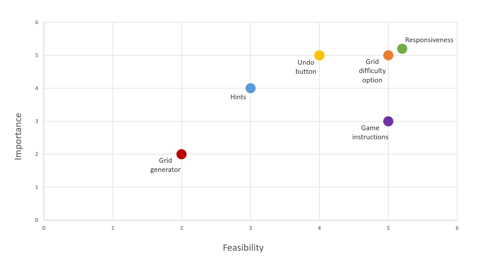

# Sudoku
The aim of this project is to create a grid based number puzzle called Sudoku. It will have a simple, one page design and different features that make the game more enjoyable.
  
This is the second project in Code Institute Full Stack Developer program based on HTML, CSS, JavaScript and optional frameworks.

## UX

### User Stories

- I am a first-time player and am interested in finding out how the game is played.
- I am a casual player and I want to play a fun Sudoku game with a nice design and simplicity of use.
- I am an expert player and want more difficult puzzles to challenge myself and improve logic skills.
- I want different features that will make it easier to play the game like the undo button for when I make a mistake.
- I want the game experience to be as good on mobile as it is on desktop so I can play on the go.

### Planes of UX

#### Strategy

There does not seem to be a lot of research available on what a typical Sudoku player is like and if the preferred way of playing is desktop or mobile. Inspiration on design and features to include will be taken from other online Sudoku games. Simple features will be implemented with possible addition of more complex features depending on feasibility. The main goals are to create a fully responsive website/game that covers most or all of the needs expressed in the user stories. The game should be challenging, easy to use and fun to play.  

> I have generated a chart based on the importance and feasibility of the main goals. This is just an estimate and it might prove that some features are harder to implement than expected. Most goals are high on the chart apart from generating a new sudoku grid each game. That will have the lowest priority.

#### Scope

1. The game should be playable and offers the same experience across different devices. This means that a number keyboard is on screen to enable mobile inputs.
2. The minimum playable version includes a premade grid, a win/lose scenario when the grid is filled and a new game button.
3. Game instructions are included.
4. Grid difficulty options for premade grids are available.
5. Undo button is available.
6. A hint button is available.
7. A generator should generate a new grid each game.

> This list should be done in order as the tasks were defined in the strategy plane. When it comes to grid generator, it is not something that necessary improves the game since the difficulty is not generated. From the users perspective it is not as important, but as it is the hardest thing to do and it is a good JavaScript challenge, it might still be included.

#### Structure
The website is a simple, single-page game and no advanced structure is necessary. Main focus will be the Sudoku grid which will be surrounded by other features. The number keyboard should be on the bottom while on mobile since it is easy to reach. The only feature that will lead from the main page will be the instructions. They will be implemented via modal which has an easy navigation.

#### Skeleton
[Mobile wireframe](assets/images/README_images/mobile-wireframe.png)  
[Desktop wireframe](assets/images/README_images/desktop-wireframe.png)

> The wireframes are not too complex and just show the general layout which will more than likely be improved upon.

#### Surface
Since the game of Sudoku is analytical, a more serious, non-script font type will be used. 

## Technologies used

##### Languages and frameworks

 HTML5  

 CSS3  

 JavaScript  

 jQuery

##### Repository, coding enviroment and version control

- [Github](https://www.gitpod.io/) - hosting platform for managing repositories and more
- [Gitpod](https://www.gitpod.io/) - coding enviroment
- [Git](https://git-scm.com/) - used for version control

#####  Resources

- [Google Fonts](https://fonts.google.com/) - source of all fonts on the website
- [Adobe XD](https://www.adobe.com/ie/products/xd.html) - used for frameworks
<!-- - [Am I responsive](http://ami.responsivedesign.is/) - website look comparison above the project title -->

## Testing 

### Browser Compatibility

- Testing for desktop will be done on Mozilla Firefox, Google Chrome, Microsoft Edge and Opera. It will not be tested on Internet Explorer since the support for it is ending soon and most websites already do not support it.  

- Mobile testing will be done on Safari, Samsung Internet and Google Chrome for mobile on different devices.

### Responsiveness

Since the screen is smaller on mobile, there is a numpad on the website. Having a mobile keyboard pop up every time a field is selected would not be an enjoyable experience. Therefore, the keyboard is disabled on screens with the width smaller than 1000.  

### Encountered issues and challenges

- I assumed that the number that the user entered was correct if it does not match any in the same column, row or square. It turned out to be more complicated than that since the grid has a unique solution. The row, column and square checks can still be used to indicate what the user did wrong. Therfore, it did not cause a setback but it made me rethink the validation proccess. The entered number is now checked by what it should be in the solution.  

- When starting the project, it seemed that only a keyup event would be possible to implement. That decision caused a few bugs outlined in the next section which required the event to be changed. It happened to be useful since a part of the code was refractured and simplified. I realised it is good to revisit previously written code at a later stage of the project with a fresh perspective.

### Bugs

- A disableMobile() function used to disable mobile keyboards was making the keyboard occasionally pop up and disappear. A timeout function was added to enable the input again after 100 milliseconds which fixed the issue.
- When focus was put on another cell while the enteredValueCheck() function was running, the values inside the second for loop were changed as well. Local variables were added to store values for each function execution.
- Entering wrong values made them appear in the grid before dissapearing. Changing the input function to keydown fixed the issue.
- Entering values rapidly while clicking on random cells validates even the wrong inputs. Changing the input function to keydown fixed the issue.
> Only the bugs that required a longer time to discover and fix were put here. There were minor bugs along the way, but were not included in this section since it would be too long. For more information check out commits with "small bug fixes" in the title which have a comment for each bug fix.

